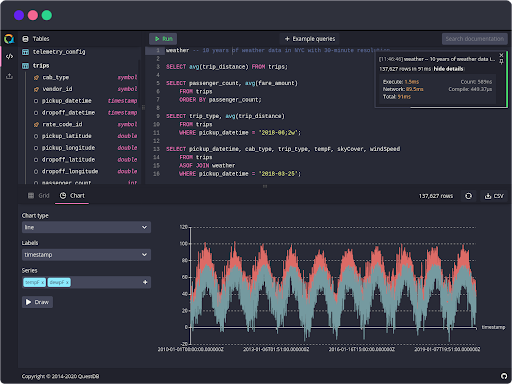
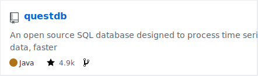
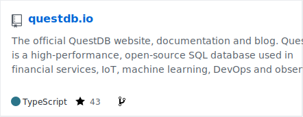

  

  

# 🌟 About us

Hi! 👋 We're the team behind QuestDB, the high-performance open-source database for time series.
The entire project is built from scratch in Java and C++, with no dependencies, and is 100% free from garbage collection.

  

## Why QuestDB?

- ⚡ Built for performance
- ⌚ Optimized for time series
- 🔧 Runs SQL as a query language

Query our [live demo](https://demo.questdb.io/) which includes a 1.6 billion row dataset with 10 years of NYC taxi trips, geospatial data, and weather records to try out.

# 🔎 Our projects

Here's QuestDB's main project repositories:

  

  

# 🚀 Product Roadmap

Major features incoming:

- [ ] Clustering
- [ ] Performance improvements (filtering, nested `WHERE` clauses)
- [ ] Integrated Python environment

Our project boards:

- [SQL](https://github.com/questdb/questdb/projects/8)
- [HTTP / REST API](https://github.com/questdb/questdb/projects/10)
- [Storage](https://github.com/questdb/questdb/projects/11)
- [Web console](https://github.com/questdb/questdb/projects/9)
- [Integrations](https://github.com/questdb/questdb/projects/13)
- [PostgreSQL wire protocol](https://github.com/questdb/questdb/projects/7)
- [InfluxDB line protocol](https://github.com/questdb/questdb/projects/6) (ILP)

Looking for a feature that's not on our current roadmap?
Start a thread on [GitHub Discussions](https://github.com/questdb/questdb/discussions) or make a detailed proposal by creating a new issue.

# 💡 Resources

**📚 Read the docs**

- [QuestDB documentation:](https://questdb.io/docs/introduction/) understand how to run and configure QuestDB.
- [Tutorials:](https://questdb.io/tutorial/) learn what's possible with QuestDB step by step.
- [Product roadmap:](https://github.com/questdb/questdb/projects) check out our plan for upcoming releases.

**❓ Get support**

- [Community Slack:](https://slack.questdb.io/) join technical discussions, ask questions, and meet other users!
- [GitHub issues:](https://github.com/questdb/questdb/issues) report bugs or issues with QuestDB.
- [GitHub discussions:](https://github.com/questdb/questdb/discussions) propose new features or show what you've built.
- [Stack Overflow:](https://stackoverflow.com/questions/tagged/questdb) watch our tag `questdb`, help the community, or look for common troubleshooting solutions.

👥 **Enterprise customers**

- [Case studies](https://questdb.io/customers): see what our enterprise users say and read the case studies
- [Contact us:](https://questdb.io/enterprise) we would love to meet you learn more about your requirements!

# 🤝 Contributing

We are always happy to have contributions to the project whether it is source code, documentation, bug reports, feature requests or feedback. To get started with contributing:

- Have a look through our [good first issues](https://github.com/questdb/questdb/issues?q=is%3Aissue+is%3Aopen+label%3A%22Good+first+issue%22).
- Read the [contribution guide](https://github.com/questdb/questdb/blob/master/CONTRIBUTING.md).
- For details on building QuestDB, see the [build instructions](https://github.com/questdb/questdb/blob/master/core/README.md).
- [Create a fork](https://docs.github.com/en/github/getting-started-with-github/fork-a-repo) of QuestDB and submit a pull request with your proposed changes.

✨ As a sign of our gratitude, we also send **QuestDB swag** to our contributors.

[Claim your swag here](https://questdb.io/community) 🙌

# 💬 Receive Updates

- Star our [Github repository](https://github.com/questdb/questdb)
- Follow us on [Twitter](https://twitter.com/QuestDb)
- Follow us on [Linkedin](https://www.linkedin.com/company/questdb/)
- Subscribe to our [Newsletter](https://questdb.io/community/)

# 🌍 We are hiring!

We're always looking for talents that add extra knowledge and skills to our team!

- 🆕 [Customer Success Engineer](https://questdb.io/careers/customer-success-engineer/)
- 🆕 [People and Talent Acquisition](https://questdb.io/careers/head-of-talent/)
- [Core Database Engineer](https://questdb.io/careers/backend-software-engineer/)
- [Developer Relations Engineer](https://questdb.io/careers/developer-relations-engineer/)

And there are more openings! Visit our [career page](https://questdb.io/careers/) to understand more about our company culture.
